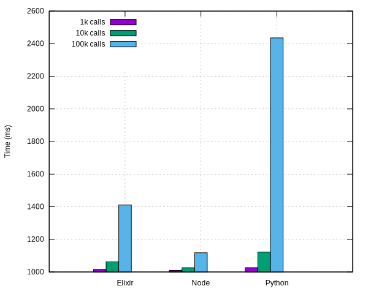
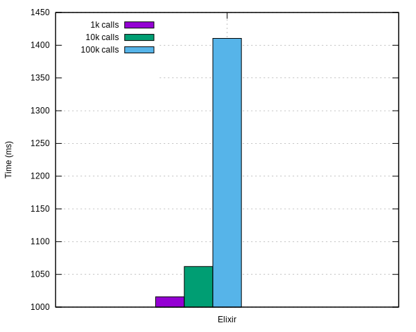
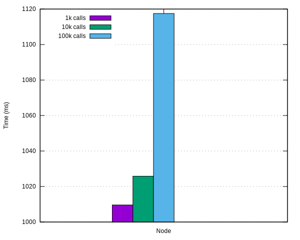
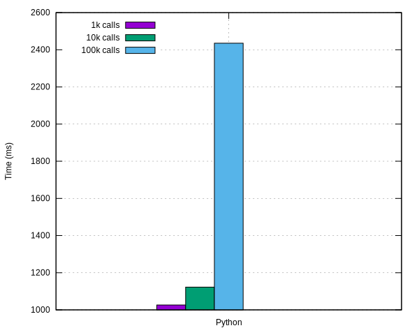

## Async Bench
A ~~shallow~~ comparison of [Python](https://www.python.org/) vs
[Elixir](https://elixir-lang.org/) vs
[Node](https://nodejs.org/en/)
for asynchronous code.

### Results
Some initial results running it with 1k, 10k and 100k async calls:


#### Elixir


#### Node


#### Python


### Code
Code used simply call an asynchronous function that sleeps for 1 second
10k times and measure the time taken.

There is some code for measuring time in each snippet but their core can be
reduced to:

#### Python
```python
import asyncio

async def wait_n(n):
    await asyncio.sleep(n)

tasks = [wait_n(1) for i in range(10_000)]

loop = asyncio.get_event_loop()
loop.run_until_complete(asyncio.wait(tasks))
```

#### Elixir
```elixir
1..10_000
|> Enum.map(fn _ -> Task.async(fn -> :timer.sleep(1_000) end) end)
|> Enum.map(fn t -> Task.await(t, 10_000) end)
```

#### Node
```js
async function wait(delay) {
  await new Promise(resolve => setTimeout(resolve, delay * 1000))
}

async function runN(n) {
  await Promise.all(Array(n).fill(1).map(() => wait(1)))
}

runN(10000)
```

### Usage
In order to run the test code simply run `make`.

Sample usage:
```
async_bench$ make


*******************************************
|           System information            |
*******************************************
|                   |                     |
|      Memory       |         7,7Gi       |
|                   |                     |
|-------------------+---------------------|
|                   |                     |
|      Threads      |           8         |
|                   |                     |
*******************************************


Testing python ( Python 3.6.6 )
python3 source/async.py
Executed in: 1102ms


Testing elixir ( Elixir 1.6.6 (compiled with OTP 19) )
elixir source/async.exs
Executed in 1064ms


Testing node ( v10.2.1 )
node source/async.js
Executed in 1019ms
```

Running one specific test is also possible with by passing it to make:
```
async_bench$ make elixir
Testing elixir ( Elixir 1.6.6 (compiled with OTP 19) )
elixir source/async.exs
Executed in 1106ms
```

With `data/all.dat` properly populated one may regenerate the graphs with `make plot`
(*requires [gnuplot](http://www.gnuplot.info/)*):
```
async_bench$ ls plots
async_bench$ make plot
async_bench$ ls plots
all.svg  elixir.svg  node.svg  python.svg
```
